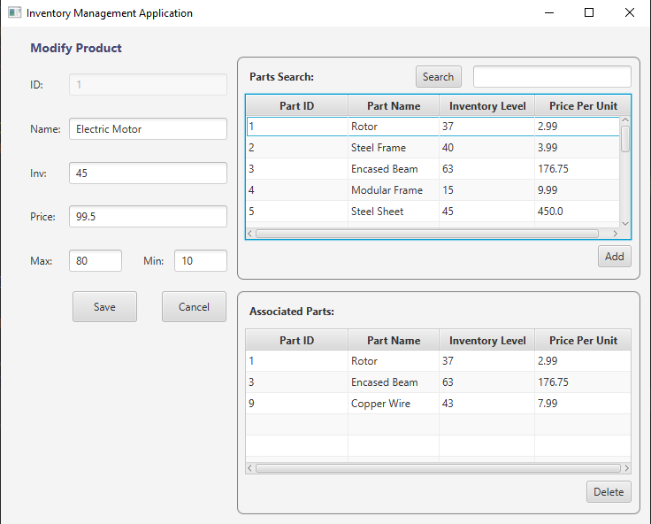

# InventoryApplication
An inventory management system written using Java and the JavaFX platform.

  This application was developed to provide a software solution for a fictional organization. The application uses data structures to maintain a local inventory of mechanical parts and products that are made with those parts. The user is able to add and modify both parts and products, as well as modify prices and inventory levels. Parts and products can be searched by name and deleted. The application does validation checks on form data and user inputs. Warning messages will alert the user if information is missing or is of the incorrect type.
  
  Main Screen:  
  
  
  Modify Parts:  
  
  
  Modify Products:  
  
  
  Error Message:  
  
